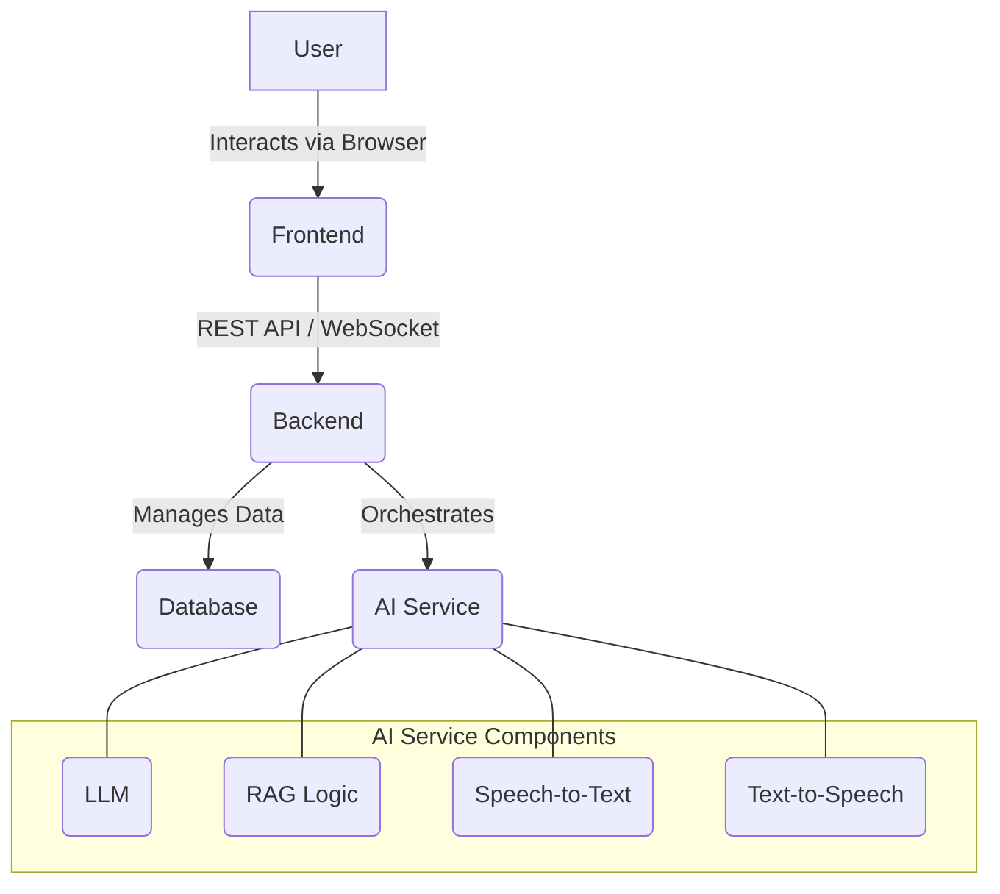

# Research Plan: AI Interview Project

## 1. Core AI Model Research (The "Interviewer")

The biggest challenge is finding a capable AI model that is free. This means avoiding paid APIs like those from OpenAI, Anthropic, or Google. Your research should focus on open-source, locally-runnable models.

### Key Research Questions:
- **What are the best open-source Large Language Models (LLMs)?**
  - Research models on platforms like Hugging Face. Look for models with permissive licenses (like MIT, Apache 2.0) that allow for free use.
  - Keywords: "Open Source LLM", "Hugging Face models", "Llama 2", "Mistral", "Falcon".
- **What are the hardware requirements for running these models?**
  - These models can be resource-intensive. Research the RAM, VRAM (if using a GPU), and disk space requirements for the models you are considering.
  - Keywords: "LLM quantization", "running LLM on CPU", "GGML", "GGUF".
- **How can the AI access specific information (Job/User data)?**
  - **Retrieval-Augmented Generation (RAG):** This is a very cost-effective technique. The idea is to retrieve relevant information from a knowledge base (e.g., the user's resume and the job description) and provide it to the LLM as context when generating a response. This is likely the best approach for your project.
    - Research: "RAG for LLM", "LangChain", "LlamaIndex".

	```mermaid
	graph TD
	    subgraph "Indexing Phase (One-time setup per document)"
	        A[User Resume & Job Description] --> B{Document Parser};
	        B --> C[Text Chunks];
	        C --> D{Embedding Model};
	        D --> E[(Vector Database)];
	    end
	
	    subgraph "Query Phase (For each question/response)"
	        F[Interview Question] --> G{Embedding Model};
	        G --> H{Similarity Search};
	        E --> H;
	        H --> I[Relevant Context from Documents];
	        I --> J{Prompt Engineering};
	        F --> J;
	        J --> K[LLM];
	        K --> L[AI Response];
	    end
	```
  - **Fine-tuning:** This is a more complex process where you train a pre-trained model on your own data. It's more expensive in terms of time and computational resources. It might be overkill for a start, but good to know about.
- **How to make the interaction feel human?**
  - **Speech-to-Text (STT):** To understand the user's spoken answers.
    - Research: "Open source STT", "Whisper STT", "Mozilla DeepSpeech".
  - **Text-to-Speech (TTS):** To have the AI ask questions with a voice.
    - Research: "Open source TTS", "Mozilla TTS", "Coqui TTS".

## 2. Software Architecture (The "Interview Room")

*(Note: The following diagrams are in Mermaid format and may require a compatible Markdown viewer to render correctly.)*

You'll need a software application to wrap around the AI model.



### Key Research Questions:
- **What backend framework should be used?**
  - Python is a strong choice due to its extensive AI/ML libraries.
    - Research: "FastAPI" (modern, fast), "Django" (more batteries-included).
- **What frontend framework should be used?**
  - For a simple interface, you can start with plain HTML, CSS, and JavaScript.
  - For a more dynamic experience, you can explore:
    - Research: "React", "Vue.js", "Svelte".
- **How to store data?**
  - You'll need a database for job descriptions, user info, and interview history.
    - Research: "PostgreSQL" (powerful, open-source), "SQLite" (simple, file-based, good for prototypes).
- **How to connect the frontend, backend, and AI model?**
  - The frontend will make API calls to the backend. The backend will then interact with the LLM (and STT/TTS services) and the database.
  - For real-time conversation, you might need WebSockets.

## 3. Data and Content (The "Interview Script")

The AI needs content to work with.

### Key Research Questions:
- **How to handle user documents?**
  - Users will provide resumes in formats like PDF or DOCX.
    - Research: "Python PDF parsing library", "python-docx".
- **How to source job descriptions?**
  - Initially, you can manually copy-paste job descriptions.
  - For a more advanced system, you could look into web scraping (be mindful of the legal and ethical implications).
- **How to generate interview questions?**
  - You can create a "bank" of questions.
  - A more dynamic approach is to use the LLM itself to generate questions based on the job description and the user's resume. This is a prompt engineering task.

## 4. The Interview Process (The "Conversation Flow")

You need to design the structure of the interview.

### Key Research Questions:
- **How to manage the conversation state?**
  - An interview has a flow: greetings, technical questions, behavioral questions, user questions, wrap-up.
  - Research: "finite state machine for conversation".
- **How to evaluate the user's answers?**
  - This is a very difficult task. A simple approach is to have the LLM summarize the user's answer and maybe provide a qualitative assessment based on a rubric you provide in the prompt.
  - A more advanced approach would involve fine-tuning a model to score answers, which is a significant research project in itself.

## 5. Project Phasing (Roadmap)

1.  **Phase 1: Core Model & Text Interface**
    - Get an open-source LLM running locally.
    - Build a simple web interface with a chat box.
    - Implement a basic RAG system where you can paste a resume and job description, and the AI asks relevant questions.
2.  **Phase 2: Add Voice**
    - Integrate STT and TTS to make the interview conversational.
3.  **Phase 3: Full Application**
    - Build out the database and user management.
    - Create a proper frontend for uploading documents and viewing interview history.
4.  **Phase 4: Evaluation & Improvement**
    - Add a feedback mechanism for users to rate the interview.
    - Use feedback to improve your prompts and potentially fine-tune your model.
